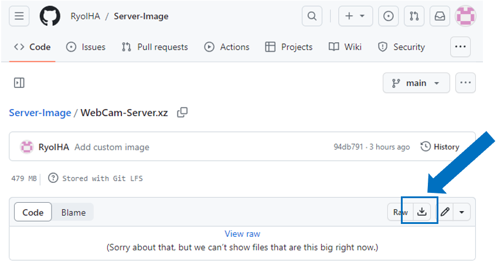
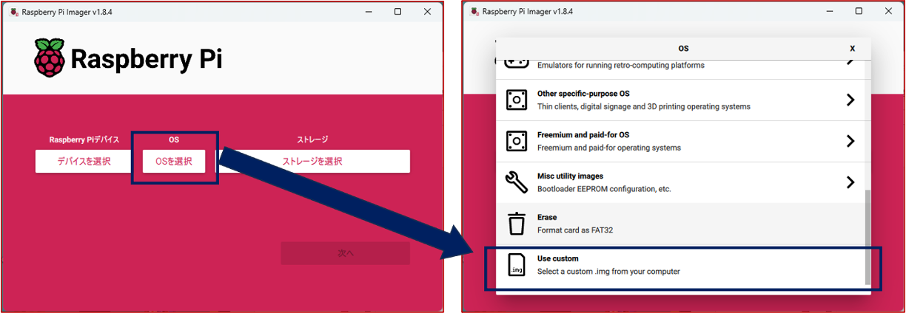
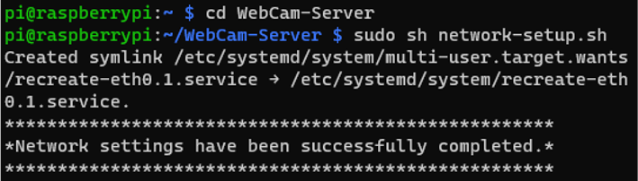
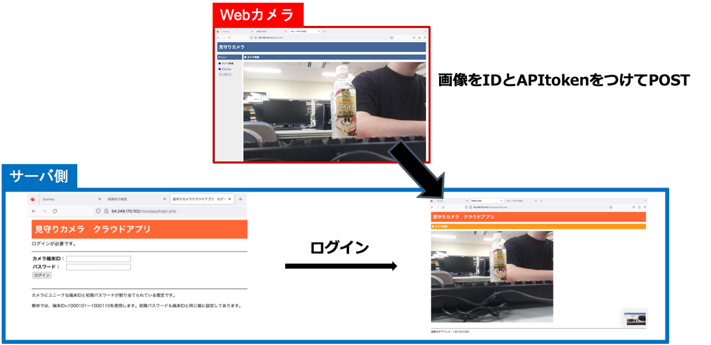

# WebCam セットアップガイド

このガイドは、Raspberry Piを使用してWebCamサーバーをセットアップする方法を説明します。手順に従って、教材インストール済みOSのインストールから環境の構築までを行ってください。

## アンケート回答のお願い
教材をご使用になる際には、使用前と使用後にアンケートへのご協力をお願いいたします。

[事後アンケート](https://forms.gle/dzUN9MFWpn4Qgbd8A)

## 内容

- 教材インストール済みOSイメージ(server.xz)
- 環境構築用スクリプトとファイル

## Raspberry PiにOSをインストールする

まず、Raspberry PiにOSをインストールします。このプロセスには、Raspberry Pi Imagerが必要です。

### Raspberry Pi Imagerの使用方法

[Raspberry Pi Imagerダウンロードページ](https://www.raspberrypi.com/software/)からRaspberry Pi Imagerをダウンロードし、インストールしてください。

### カスタムイメージのダウンロードについて

カスタムイメージはGitHub LFSを使用して管理されています。ダウンロード前に以下の手順を行ってください。

1. GitHubページからダウンロード
   「server.xz」のみをダウンロードすることが可能です。
   

2. [GitHub LFSのインストールガイド](https://docs.github.com/ja/repositories/working-with-files/managing-large-files/installing-git-large-file-storage)に従い、GitHub LFSをインストールします。

### Git LFSのインストール方法

- **Linux（Debian系）**: `sudo apt-get install git-lfs`
- **Linux（Red Hat系）**: `sudo yum install git-lfs`
- **Windows**: `git lfs install`
- **MacOS**: `brew install git-lfs`
- **以降共通の手順**: 
   `git lfs install` 
   `git clone <リポジトリのURL>` 
   `git lfs fetch` 
   `git lfs checkout`

### イメージのインストール
Raspberry Pi 4Bを使用します。
Raspberry Pi Imagerを開き、「Use custom」を選択して、ダウンロードしたカスタムイメージをMicroSDカードにインストールします。MicroSDカードは8GB以上を使用してください。

## セットアップ手順
事前にサーバー用Raspberry Piの準備を完了し、サーバー用Raspberry Pi起動に行なってください。
1. Raspberry Piを起動し、ユーザー名`pi`、パスワード`raspberry`でログインします。
2. ネットワーク設定を行います。`sudo raspi-config`を実行して設定してください。
3. `/home/pi/WebCam-Server/network-setup.sh`を実行し、設定ファイルの取得と設定を行います。
4. スクリプト実行後、プロンプトに従いサーバーのIPアドレスを入力してください。

以上の手順に従って、Raspberry Pi 4Bでカスタムイメージを使用したWebCam-Serverのセットアップを完了させてください。

## WebCam-Serverアクセスガイド

このガイドでは、WebCamにアクセスして画像を閲覧、保存する方法について説明します。

### 動作イメージのアクセス方法

**アクセス**  
   Webブラウザから`http://<WebCam-ServerのIPアドレス>`にアクセスしてください。`<WebCam-ServerのIPアドレス>`は、実際のWebCam-ServerのIPアドレスに置き換えてください。

**ログイン**  
   アクセスするとログイン画面が表示されます。次の認証情報を入力してログインしてください。
   - **ID:** 対象WebCamのDeviceID
   - **PW:** 対象WebCamのDeviceID

**ホーム画面**  
   ログイン後、自動的にホーム画面に移動します。ここでは、WebCamから送信された画像を確認できます。

### 管理者用ツール
`/home/pi/WebCam-Server/AdminTools/admin.sh`を実行することで以下の操作を行えます。
実行例：`sh admin.sh` 
・対象のWebCamをIPアドレスで指定して初期化を実行 
・WebCam全体のHTML、CSS、およびJavaScriptファイルのみ初期化 
・WebCam全体のシャットダウン

- **アップデート機能の使用不可**  
  現在、アップデート機能は使用できません。

## スクリプトのみで準備する場合

以下の手順で環境構築を行なってください。ターミナルまたはコマンドプロンプトを開いて、以下のコマンドを実行してください。

`git clone <リポジトリのURL>` 
`cd WebCam-Server` 
`sudo sh server-setup.sh` 
`sudo bash network-setup.sh`

